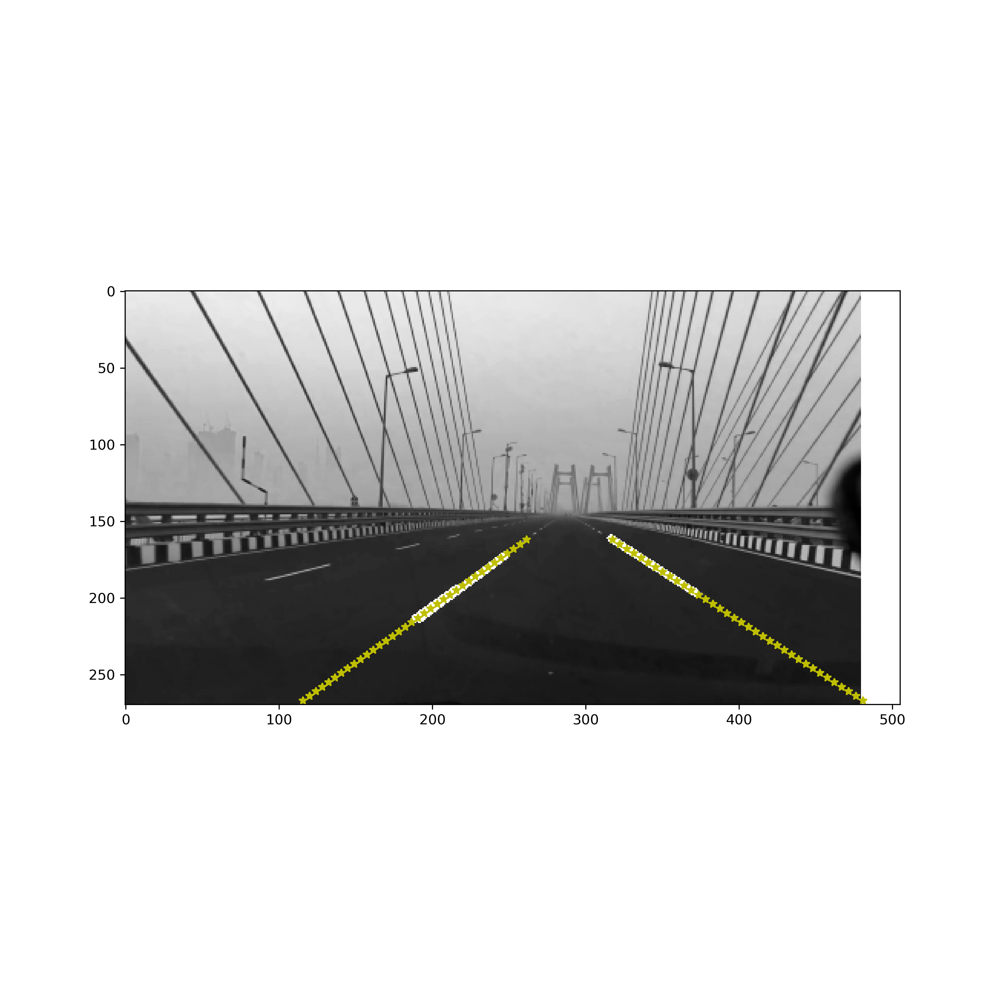
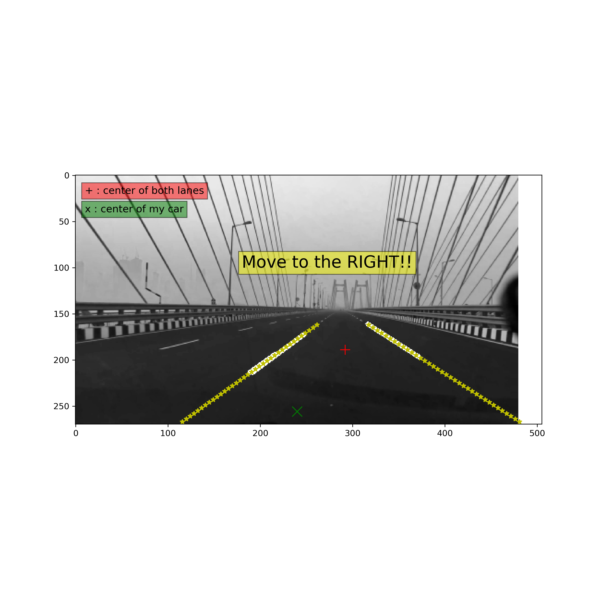

# Hough Tranform을 이용해서 차선 탐지 알고리즘을 구현하고, 개선하기

* 차선 탐지 알고리즘 구현 완료
  * 코드 중간에, 무시하고 있는 오류가 종종 있는데, 해결하기
  * TTL 개념을 적용하는 부분 미 구현 (차선 탐지가 안되면, 직전에 탐지한 차선을 사용하는데, 너무 오랫동안 차선 탐지가 안되면 아주 옛날에 탐지한 차선을 사용하게 되는거니까, 차선 미 탐지 기간이 길어지면, 서서히 frame mask 의 line으로 확장해 가는 알고리즘)

* 전체 운전 영상 (set1-driving-full.mp4)에 대해서 차선 탐지 알고리즘을 적용해 보고, 알고리즘 개선이 필요한지 확인하기
  * [Full Driving Video, set1-driving-full.mp4](https://hallymackr-my.sharepoint.com/:v:/g/personal/tkim_hallymackr_onmicrosoft_com/ESzF8GNrz-pAmnYmNBgNLLYB0aKXl51CJZtXF5gV2umIrA?e=UE7Fvu)

* 주의
  * version이 증가해 가면 점진적으로 개선사항이 있다는 것이다.
  * 하지만, v4 와 v5는 어떤 것이 좋은지에 대한 추가적인 분석이 필요한 상황이다. 둘 중 하나가 모든 상황에서 성능이 좋을 수도 있고, 아니면 상황에 따라서, 어떤 상황에서는 v4가 좋고, 어떤 상황에서는 v5가 좋은 결론이 날 수도 있다.

* 참고
  * 코드에서 TypeError가 나는 사진을 보니까, 차선을 제대로 탐지할 수 없는 경우에 발생하는 것 같다. 
    * 예를 들어, v1 주피터 노트북을 기준으로:
    * 첫번째 TypeError 사진은, 화면에 가로로 놓여진 흰색 선 때문에 오류가 생긴것 같고,
    * 나머지 TypeError 사진은, 자동차가 차선을 바꾸는 도중에 차선을 양쪽으로 탐지할 수 없었기 때문에 오류가 발생한 것 같음 => Frame Mask 안에서, 양쪽 차선 중 하나만 탐지하는 것은 괜찮은데, Frame Maks안에서, 한 가운데에 차선이 나오면 오류가 발생하는 듯...
  * cv2.threshold 대신에 cv2.adaptiveThreshold를 호출하면 더 좋은 결과가 나올지도...?

* 우리가 제안한 내용
  * Hough Transform을 기반으로 poly-fitting을 통해 차선을 완전히 탐지하는 기법 제안
  * 일부 사진/frame에서 차선을 탐지하지 못하는 경우 발생 시, 직전에 탐지한 차선을 재 사용하는 기법 제안
  * Hough Transform 이 탐지한 선 각각에 대해서 slope를 계산하고, 이를 이용해서 잘못 탐지한 차선을 제거하는 기법 제안

## Lane Detection v1

V1 : 기본적인 Lane Detection (차선 탐지) 알고리즘을 구현한 버전(Hough Line Detection, prob) // 참고: 온라인에서 찾은 tutorial을 기반으로 구현함. Tutorial 주소는 v1 노트북에서 확인할 수 있음.

차선탐지를 이용해서 자율주행을 할 때, 일반적으로 아래와 같이 동작함
1) 양쪽의 차선을 탐지
2) 양 차선증 동일한 높이에서 (이미지의 height에서 동일한 위치) 가로로 직선을 긋고, 그 중에서 중심을 찾고
3) 화면 최 하단에서 중간점을 고른다. (= 내 차량의 위치)
4) 2)와 3)에서 각각 계산한 중간점이 일치하면 정상적으로 주행하고 있는 것이고, 그렇지 않으면 차선의 중간에서 내 차량이 약간 벗어났다는 것이다. 이를 기준으로 오른쪽 또는 왼쪽으로 약간 틀어주면 차선의 중심에서 주행을 할 수 있다.

[v1의 문제점] Hough Line Transform (probabilistic version)을 사용하면, 다음과 같은 문제가 발생할 수 있다.
* 왼쪽 차선은 상단부만 검출
* 오른 차선은 하단부만 검출.
* 이 경우, 동일한 height 에서 왼 차선과 오른 차선을 직선으로 연결하는 선을 그릴 수 없게 되는 경우가 발생한다.
* 또한, 한쪽 차선 또는 모든 차선이 탐지되지 않는 경우가 발생할 수 있다.

이러한 문제를 개선하기 위해, 앞으로 차선탐지 알고리즘 v2, v3...을 만들것임.

TODO: 몇장의 사진에서 Type Error가 발생하는데... 이유는??

## Lane Detection v2

Hough Tranf 으로 탐지한 차선에다가 poly fitting (1-d, ax+b)을 해서 차선이 화면 가장 아래에서 부터, 화면 중간 정도까지 이어지도록 만들었음.

TODO: 
* 노트북에 보면 Error (left) 또는 Error (right) 라는 출력 메시지가 있는데, 이 부분은 해당 차선이 탐지되지 않아서 오류가 발생한 것이다. Hough 가 차선을 아예 탐지하지 못하면 poly fitting은 동작하지 않는다=> 여기를 고치자!!
* poly fitting 하면, 이 과정에서 시간이 너무 많이 소요 될 수 있다. 이 부분도 꼭 확인하자
* poly fitting 결과가 image 를 벗어하는 경우가 발생하네... 이미지를 벗어나지 않도록 수정하기

## Lane Detection v3
v2랑 알고리즘은 동일

구현완료:
* 양 차선의 중심과, 내 차량의 중심을 계산하여 얼마나 벗어나 있는지 체크
  * 양 차선의 중심 : poly fitting 한 두개의 선의 중심
  * 내 차의 중심 : 화면 최 하단에서, x의 중심
* 사진에 메시지를 추가했음
  * 차선의 중앙을 붉은 '+' 로, 
  * 내 차의 중앙을 녹색의 'x'로,
  * 둘 간의 차이를 고려해서, 차의 핸들을 어느 방향으로 꺾어야 하는지

## Lane Detection v4
v3랑 알고리즘은 동일

구현완료: 차선 탐지 알고리즘 개선
* 차선이 탐지되지 않는 경우 (한쪽 또는 양쪽 모두), 이전에 탐지한 차선을 재사용 하는 것으로 구현
  * 차선탐지를 시작한 이후로 한번도 탐지되지 않으면, 이전에 탐지한 차선이 없어서 재사용 할 수가 없으므로, 이 경우에는 Frame Mask를 이전에 탐지한 차선으로 가정하고 사용한다.
  * '+' 기호를 조금 더 올렸고, 'x' 기호를 조금 더 내렸다.
* Hough 알고리즘이 탐지한 line중에서 slope(경사)가 너무 이상한 선들이 있었다. 이 경우, 차선 말고, 다른 선을 잘못 탐지한 경우이다. 코드를 수정해서, 잘못 탐지된 선을 모두 무시하도록 수정했다.  

TODO
* 너무 오랫동안 차선이 탐지되지 않으면, 옛날에 탐지한 차선을 계속 하용할텐데? TTL(time to live) 개념을 적용해서, 차선이 탐지 안되면, 직전에 탐지한 차선을 쓰되, 시간이 지나면 서서히 Frame Mask 쪽으로 옮겨 가도록 구현하자.

## Lane Detection v5

(이제는 어떤 경우에도 양쪽 차선을 찾을 수 있다. 최악의 경우 Frame Mask를 쓰면 되니까...)

구현 완료
* polyfit, degree=2로 fitting 하기 (ax^2+bx+c)
  * Degree가 2보다 커지는건 큰 의미가 없다고 생각함
* Degree=2로 fitting 할때, Hough Transf이 찾은 선에서 추가로 많은 점을 sampling 한 후, fitting을 해야지, 안그러면 degree=2 fitting 결과가 이상하게 나오는 경우가 종종 발생한다.
* Hough 알고리즘이 탐지한 line중에서 slope(경사)가 너무 이상한 선들이 있었다. 이 경우, 차선 말고, 다른 선을 잘못 탐지한 경우이다. 코드를 수정해서, 잘못 탐지된 선을 모두 무시하도록 수정했다.

탐지한 차선을 보면, 대부분의 경우에는 이전의 알고리즘과 별로 다르지 않을 것이다. 나중에 곡선이 등장하는 영상을 입력으로 주고, v5가 곡선 형태로 차선을 탐지할 수 있는지를 확인하자

문제 발생
- 차선이 너무 일부만 탐지된 경우에는, 아예 이상한 곡선을 그려 버린다. 차라리 1d로 fitting 하는게 나은 것 같은데, 곡선 주로에서 테스트 해 보고, 1d랑 2d랑 별 차이가 없으면 그냥 1d를 사용하는 걸로 하자

## Lane Detection v6

TODO: 
* 로로로로후후후후

